# Closer

> A chat and meet application that brings people closer, and it's goal is to provide all the features as seamlessly as possible.

Users can create as many rooms as they want, they can also join all the rooms they have been invited to join. There's no limitation on number of users in a room. Users sharing a common room can have high quality video-meetings. There are more features such as user-authentication, in-meeting chat, integrated share functionality and more.

Platform: Android (Smartphones, Tablets, TVs...)

## Using the Application

Install the application via this link

It's made very intuitive, you'll know exactly what to do.

## Pitch / Demo

Please visit this link

## Tools used

Agora's React Native SDK (I found this one gave the most flexibility)

React Native

Firebase (Authentication) and Firestore (Realtime Database)

## Application Flow

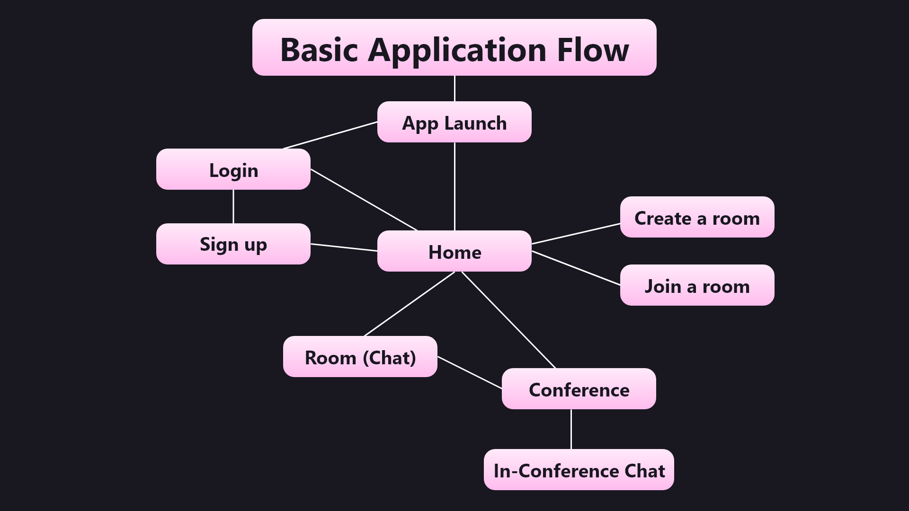

## Suggested order for reading this project

- App.js
- ./Navigation Folder
- ./Components Folder
- LoginScreen.js
- SignupScreen.js
- HomeScreen.js
- AddRoomScreen.js
- JoinRoomScreen.js
- RoomScreen.js
- ConferenceScreen.js
- ModalChatScreen.js

## Screenshots

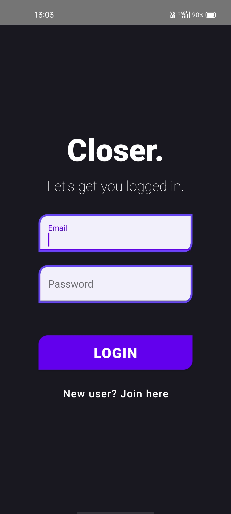

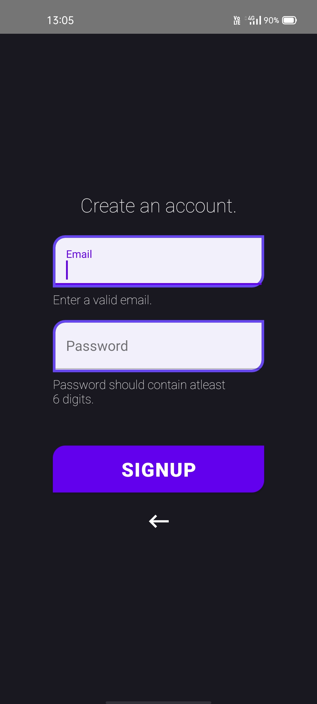

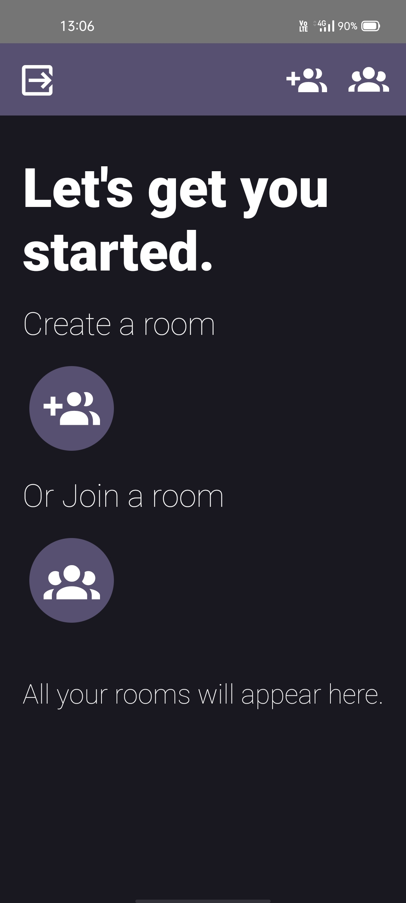

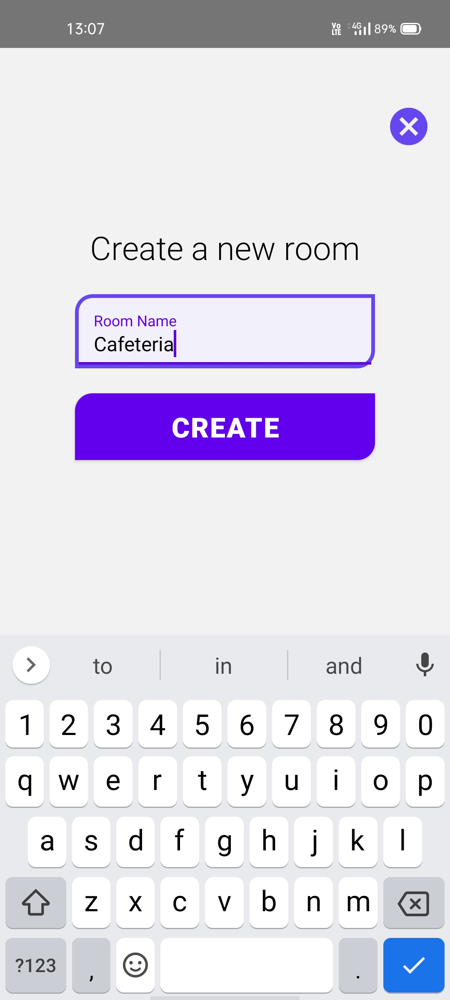

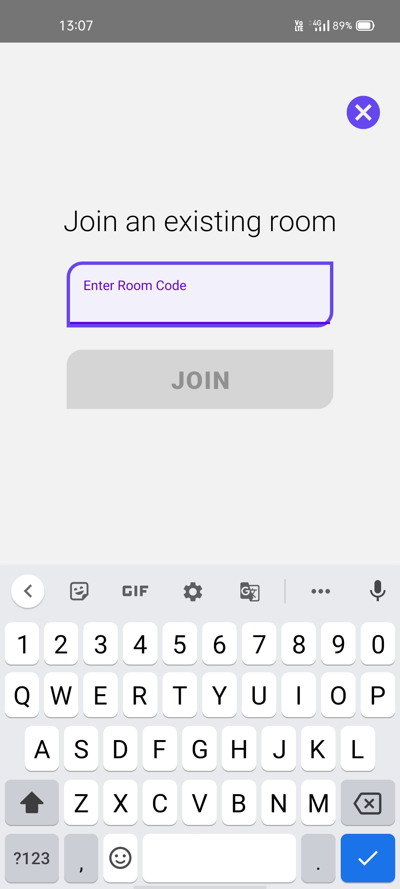

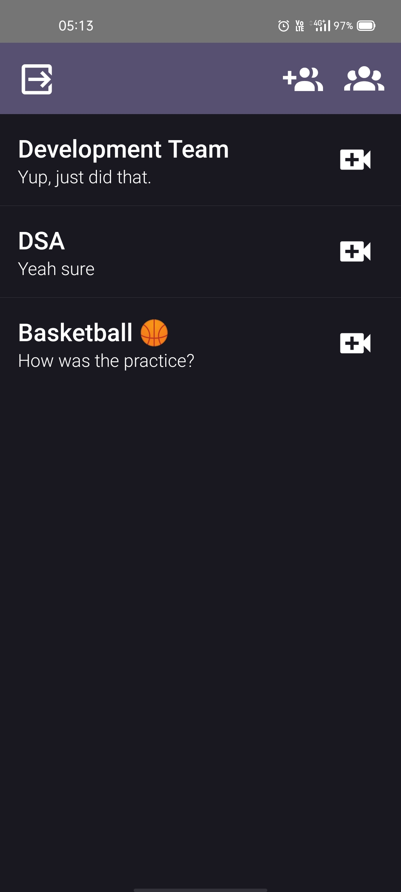

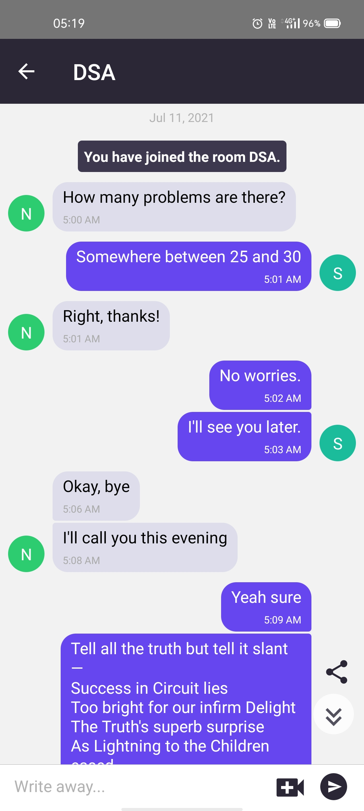

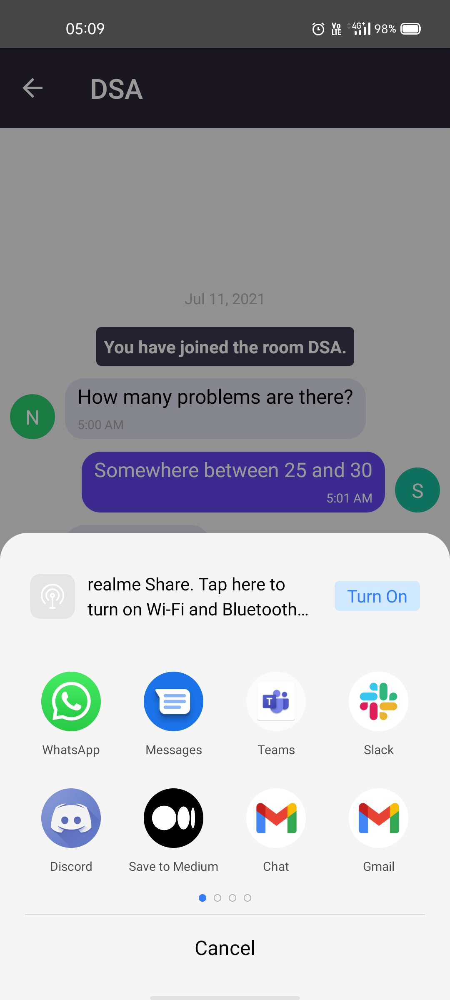

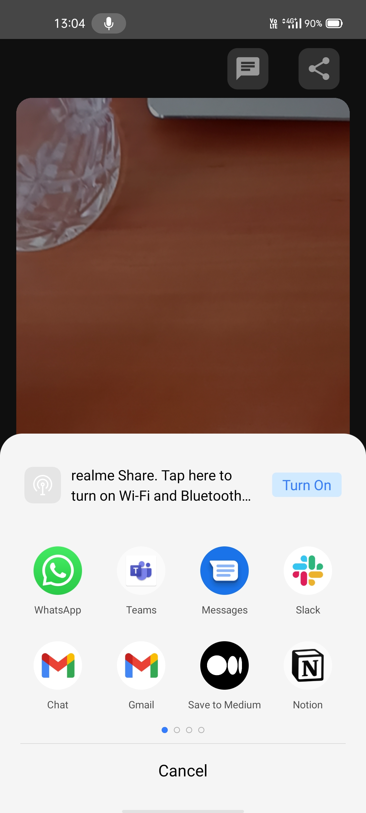

On Tablet:

(Supported on all Android devices)

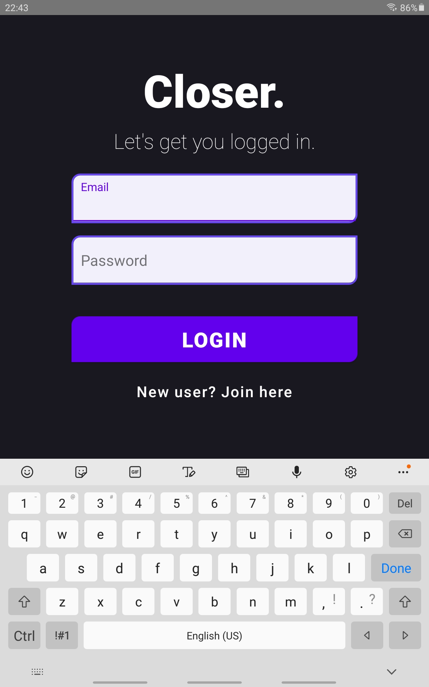

Have the full experience by installing the application, and explore little features here and there.

## Some of the key features provided by Closer

- User Authentication
- Accessible from anywhere in the world, just 1 click away from all your conversations
- Realtime Chatting
- Persistent chats, stays with you forever
- High quality video meetings, again just 1 click away
- In-meeting chatting so you don't have to quit the meet and have a seamless experience, and yes these are stored forever as well
- Invite co-workers, friends and family to join a room (while chatting or even while in a meet)
- Join only the rooms you want to
- Get closer to the people you want to, and away from those you don't

Download the application to explore more features here and there.

> Use the application and read the code above **to see more features** and **how they were achieved**. Please visit this video to see how **Agile methodology** was used to build the application and to see a **demo** as well.
